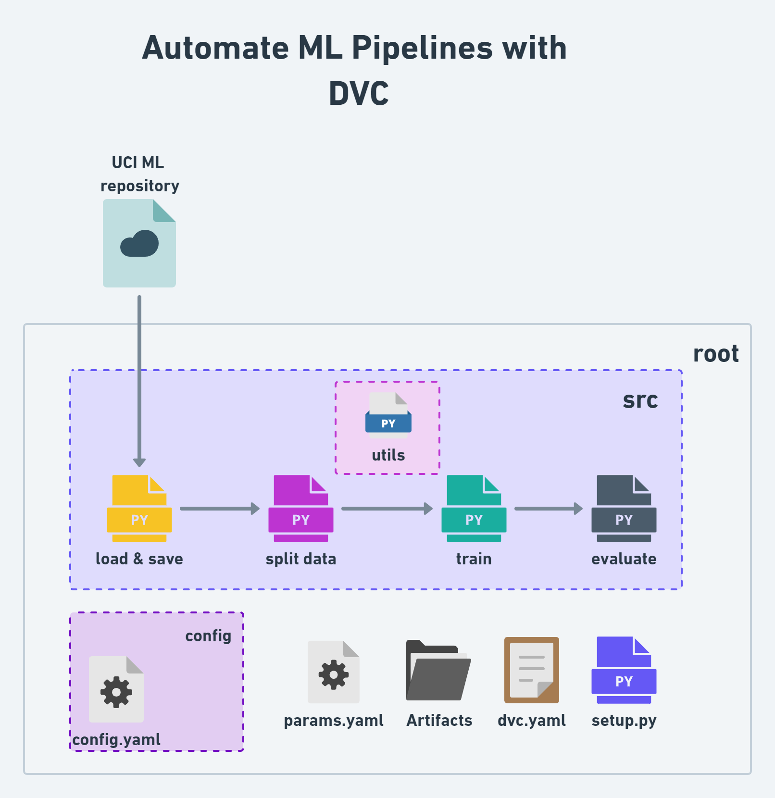

"# dvc-ML-demo-AIOps" 

## Reference repo:
https://github.com/c17hawke/dvc-ML-demo-AIOps

## wokflow -


# STEPS:
## STEP 01: Create a empty remote repository


## STEP 02: intialize a git local repository and connect to remote repository

* open and project folder in VS code then follow below command -

```bash
echo "# dvc-ML-demo-AIOps" >> README.md
git init
git add README.md
git commit -m "first commit"
git branch -M main
git remote add origin https://github.com/USER_NAME/REPO_NAME.git
git push -u origin main
```

```bash
touch .gitignore
```
content of the gitignore can be found from reference repository

```bash
create a empty git repository
```

## STEP 03: create and activate conda environment
```bash
conda create -p ./myenv python==3.10
conda activate ./myenv
 ```

## STEP 03_1: create the basic directory structure
```bash
mkdir -p src/utils
touch src/__init__.py
 
touch src/utils/__init__.py
touch params.yaml dvc.yaml
 
mkdir config
 ```


## STEP 04: create a setup file
```bash
touch setup.py
```

paste the below content in the setup.py file and make the necessary changes as per your user ID-

```python
from setuptools import setup

with open("README.md", "r", encoding="utf-8") as f:
    long_description = f.read()

setup(
    name="src",
    version="0.0.1",
    author="sobz2019",
    description="A small package for dvc ml pipeline demo",
    long_description=long_description,
    long_description_content_type="text/markdown",
    url="https://github.com/sobz2019/dvc-ML-demo-AIOps",
    author_email="sobz87@gmail.com",
    packages=["src"],
    python_requires=">=3.10",
    install_requires=[
        'dvc',
        'pandas',
        'scikit-learn'
    ]
)
```

## STEP 05: create requirement file and install dependencies
```bash
touch .gitignore
touch requirements.txt
        dvc
        pandas
        scikit-learn
        
        #local packages -
        -e .
 pip install -r requirements.txt
 ```

 ## STEP 06: initialize dvc
```bash
dvc init
```

## STEP 07: create the config file 
```bash
touch config/config.yml
```

content of config.yml - 

```yaml

data_source: http://archive.ics.uci.edu/ml/machine-learning-databases/wine-quality/winequality-red.csv

artifacts: 
  artifacts_dir: artifacts
  raw_local_dir: raw_local_dir
  raw_local_file: data.csv

```


## STEP 08: create the stage 01 python file and all_utils file:
```bash
touch src/stage_01_load_save.py src/utils/all_utils.py
```
content of both these files can be refererd from the corresponding folder


## STEP 09: create the dvc.yaml file and add the stage 01:
```bash
touch dvc.yaml
```

content of dvc.yaml file -
```yaml
stages:
  load_data:
    cmd: python src/stage_01_load_save.py --config=config/config.yaml
    deps:
      - src/stage_01_load_save.py
      - src/utils/all_utils.py
      - config/config.yaml
    outs:
      - artifacts/raw_local_dir/data.csv
```


## STEP 11: run the dvc repro command
```bash
dvc repro
```

## STEP 12: push the changes to remote repository
```bash
git add .
git commit -m "stage 01 added"
git push origin main
```

## Step 13: For Data Versioning using DVC

### 13.1-	Add your CSV file to DVC
```bash
dvc add data.csv
```
This command will:
•	Move data.csv to the .dvc directory.
•	Create a .dvc file (data.csv.dvc) that contains the tracking information for your data file.

### 13.2-	Commit the changes: 

Commit the changes to Git, including the DVC file and the .gitignore updates.
```bash
git add data.csv.dvc .gitignore
git commit -m "Add data.csv to DVC"
```

### 13.3-	Store the data remotely: 

To ensure that your data is backed up and can be retrieved later, configure a remote storage (this could be S3, Google Drive, SSH, etc.). Here’s an example using an S3 bucket:

```bash
dvc remote add -d myremote s3://mybucket/path
```
 
####  or 

### If u want to setup a local DVC remote

You can specify a directory in your project to act as the local remote storage. Let's say you want to use a directory named .dvcstore within your project folder

```bash
dvc remote add -d localremote .dvcstore
```

### 13.4-	Push the data to the local remote:
```bash
dvc push
```

### 13.5-	Making and tracking changes: 

When you make changes to data.csv, you need to re-add it to DVC and commit the changes.

```bash
dvc add data.csv
git add data.csv.dvc
git commit -m "Update data.csv with new changes"
dvc push
```

### 13.6-	Retrieving previous versions: 

If you want to go back to a previous version of your data, you can use Git to checkout the corresponding commit and then use DVC to retrieve the data file.

```bash
git log # Find the commit hash you want to revert to
git checkout <commit-hash>
dvc checkout
```

